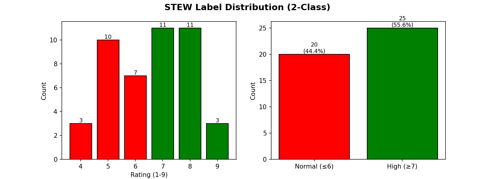
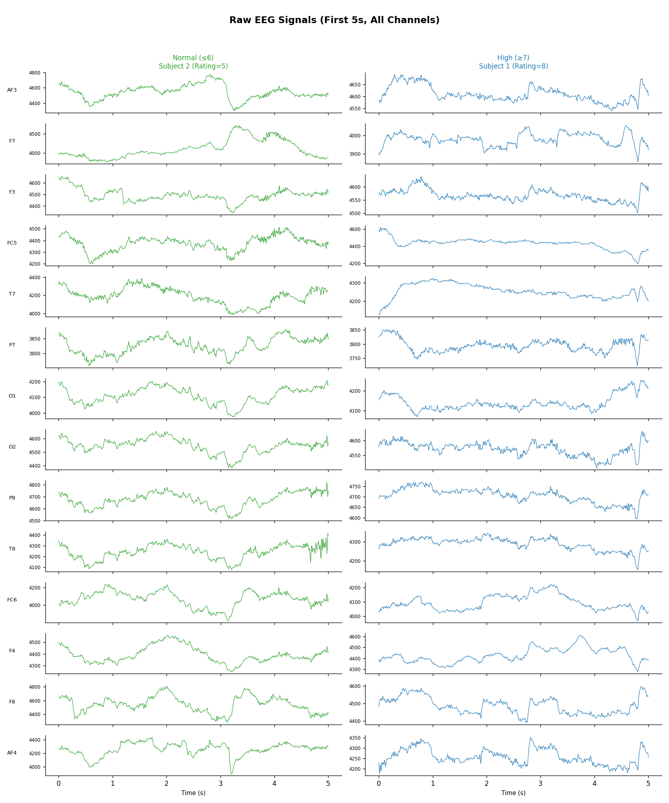
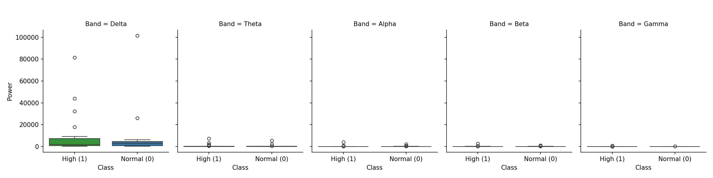
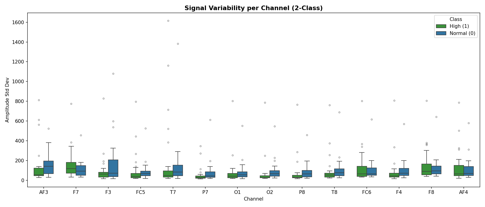
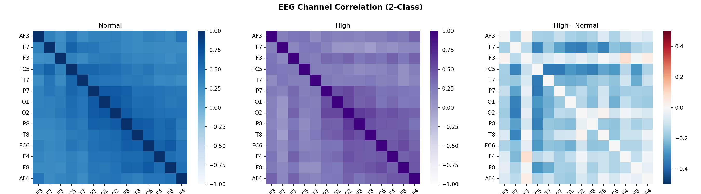
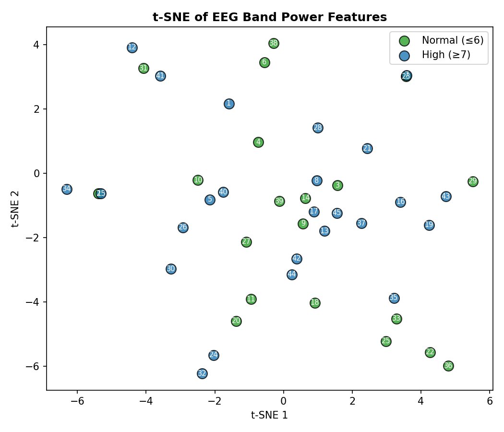

# Visual Learners Detection using EEG

A deep learning project for classifying visual learning ability using EEG (Electroencephalography) signals from the STEW (Short-Term Cognitive Workload) dataset. This project analyzes brain activity patterns to identify individuals with high visual learning capabilities.

## Project Overview

This project uses EEG data to classify subjects into two categories based on their self-reported visual learning ratings (STEW scale 1-9):

- **Normal (≤6)**: 20 subjects (44.4%)
- **High (≥7)**: 25 subjects (55.6%)

The analysis includes:

- EEG signal preprocessing and visualization
- Frequency band power analysis (Delta, Theta, Alpha, Beta, Gamma)
- Statistical analysis of channel variability and correlations
- Feature extraction and dimensionality reduction (t-SNE)
- Neural network classification

## 🧠 Dataset

**STEW Dataset** - Mental Cognitive Workload EEG Data

- **Source**: [Kaggle Dataset](https://www.kaggle.com/datasets/mitulahirwal/mental-cognitive-workload-eeg-data-stew-dataset)
- **Subjects**: 45 participants
- **Channels**: 14 EEG channels (AF3, F7, F3, FC5, T7, P7, O1, O2, P8, T8, FC6, F4, F8, AF4)
- **Sampling Rate**: 128 Hz
- **Duration**: 150 seconds per subject
- **Total Samples**: 19,200 timepoints per subject per channel
- **Device**: Emotiv EPOC+ headset

### Brain Regions Coverage

- **Frontal**: AF3, F3, F4, AF4
- **Prefrontal**: F7, F8
- **Central**: FC5, FC6
- **Temporal**: T7, T8
- **Parietal**: P7, P8
- **Occipital**: O1, O2

### Frequency Bands Analyzed

- **Delta** (0.5-4 Hz): Deep sleep, unconscious processes
- **Theta** (4-8 Hz): Drowsiness, meditation, creativity
- **Alpha** (8-13 Hz): Relaxation, calmness, flow states
- **Beta** (13-30 Hz): Active thinking, focus, anxiety
- **Gamma** (30-45 Hz): High-level processing, learning, memory

## 🖼️ Sample Visualizations

The project generates several informative visualizations:

### 1. Label Distribution


_Distribution of subjects across Normal and High visual learning categories_

### 2. Raw EEG Timeseries


_First 5 seconds of raw EEG signals across all 14 channels for Normal and High learners_

### 3. Band Power Analysis


_Spectral power analysis across five frequency bands (Delta, Theta, Alpha, Beta, Gamma)_

### 4. Channel Amplitude Statistics


_Signal variability across all 14 EEG channels for both classes_

### 5. Channel Correlations


_Correlation matrices showing inter-channel relationships_

### 6. t-SNE Visualization


_2D embedding of high-dimensional EEG features showing class separability_

## 🚀 Quick Start

### Prerequisites

- Docker with GPU support (NVIDIA Docker)
- NVIDIA GPU with CUDA support
- At least 8GB RAM
- ~2GB free disk space

### Running with Docker (GPU-Enabled)

The project uses TensorFlow GPU for accelerated training and inference.

```bash
# Clone the repository
git clone <repository-url>
cd visual-learners-detection

# Run the Docker container with GPU support
docker run --gpus all -it -p 8888:8888 \
  -u $(id -u):$(id -g) \
  -v $(pwd):/tf:Z \
  tensorflow/tensorflow:2.15.0-gpu-jupyter

# The Jupyter notebook server will start automatically
# Open the URL shown in the terminal (e.g., http://127.0.0.1:8888/?token=...)
```

### Docker Command Explanation

- `--gpus all`: Enables access to all available GPUs
- `-it`: Interactive terminal
- `-p 8888:8888`: Maps port 8888 for Jupyter access
- `-u $(id -u):$(id -g)`: Runs container with your user permissions (avoids permission issues)
- `-v $(pwd):/tf:Z`: Mounts current directory to `/tf` in container with SELinux context
- `tensorflow/tensorflow:2.15.0-gpu-jupyter`: Official TensorFlow GPU image with Jupyter pre-installed

### Alternative: Local Installation

If you prefer running without Docker:

```bash
# Create virtual environment
python3 -m venv venv
source venv/bin/activate  # On Windows: venv\Scripts\activate

# Install dependencies
pip install tensorflow-gpu==2.15.0  # For GPU support
# OR
pip install tensorflow==2.15.0      # For CPU only

pip install scipy matplotlib seaborn numpy kagglehub pandas scikit-learn jupyter
```

## 📦 Dependencies

Core libraries (automatically installed in Docker container):

```
tensorflow-gpu==2.15.0  # Deep learning framework with GPU acceleration
scipy                   # Signal processing and statistics
matplotlib              # Data visualization
seaborn                 # Statistical visualizations
numpy                   # Numerical computing
kagglehub              # Dataset downloading
pandas                  # Data manipulation
scikit-learn           # Machine learning utilities
jupyter                # Notebook interface
```

## 📁 Project Structure

```
visual-learners-detection/
├── README.md                          # This file
├── visual_learners_detection.ipynb   # Main Jupyter notebook
├── data/                              # Dataset directory (auto-created)
│   ├── dataset.mat                   # EEG data (downloaded automatically)
│   ├── rating.mat                    # Subject ratings
│   ├── class_012.mat                 # 3-class labels
│   └── three_class_one_hot.mat       # One-hot encoded labels
└── images/                            # Generated visualizations
    ├── label_distribution.png
    ├── raw_eeg_timeseries.png
    ├── band_power_2class.png
    ├── channel_amplitude_stats.png
    ├── channel_correlations.png
    └── tsne_2class.png
```

## 🔬 Methodology

### 1. Data Loading & Preprocessing

- Automatic dataset download from Kaggle via `kagglehub`
- Binary classification: Normal (≤6) vs High (≥7) visual learners
- Data normalization and quality checks
- Shape: (45 subjects, 19200 samples, 14 channels)

### 2. Exploratory Data Analysis

- **Temporal Analysis**: Raw signal visualization across channels
- **Spectral Analysis**: Power spectral density using Welch's method
- **Statistical Analysis**: Per-channel amplitude statistics and correlations
- **Dimensionality Reduction**: t-SNE for feature space visualization

### 3. Feature Extraction

- **Band Power Features**: Spectral power in each frequency band per channel
- **Statistical Features**: Mean, standard deviation, min, max per channel
- **Correlation Features**: Inter-channel connectivity patterns
- **Total Features**: 70 features (14 channels × 5 frequency bands)

### 4. Classification

The notebook includes implementation for:

- Feature scaling using StandardScaler
- Train/validation/test split
- Neural network architecture (to be implemented/customized)
- Model evaluation metrics

## 🎯 Key Findings

Based on the visualizations:

1. **Band Power Distribution**:
   - Delta band shows highest power and most variance
   - Theta, Alpha, Beta, and Gamma bands show more subtle differences
   - High learners show slightly elevated delta power in some channels

2. **Channel Variability**:
   - Frontal channels (AF3, F7, F3) show higher variability
   - Occipital channels (O1, O2) show more consistent patterns
   - Class differences are subtle but present

3. **Correlation Patterns**:
   - Normal learners show stronger inter-channel correlations (bluer heatmap)
   - High learners show slightly weaker correlations (more purple)
   - Correlation differences (High - Normal) reveal specific channel relationships

4. **Feature Space**:
   - t-SNE shows moderate overlap between classes
   - Some clustering is visible, suggesting discriminative features exist
   - Individual subject variability is high

## 🔧 Customization

### Modifying Classification Threshold

Edit the threshold in the notebook:

```python
# Current: 2-class (Normal ≤6, High ≥7)
labels2 = (ratings >= 7).astype(int)

# Alternative: More strict (Normal ≤5, High ≥8)
labels2 = (ratings >= 8).astype(int)

# Alternative: 3-class (Low, Medium, High)
labels3 = np.where(ratings <= 5, 0, np.where(ratings <= 7, 1, 2))
```

### Adjusting Frequency Bands

Modify the `freq_bands` dictionary:

```python
freq_bands = {
    'Delta': (0.5, 4),
    'Theta': (4, 8),
    'Alpha': (8, 13),
    'Beta': (13, 30),
    'Gamma': (30, 45),
}
```

### Selecting Specific Channels

Focus on specific brain regions:

```python
# Example: Analyze only frontal channels
frontal_channels = ['AF3', 'F3', 'F4', 'AF4']
channel_indices = [channel_names.index(ch) for ch in frontal_channels]
eeg_frontal = eeg[:, :, channel_indices]
```

## 📊 Performance Metrics

The model evaluation includes:

- **Accuracy**: Overall classification accuracy
- **Precision**: Positive predictive value
- **Recall**: Sensitivity/True positive rate
- **F1-Score**: Harmonic mean of precision and recall
- **Confusion Matrix**: Detailed classification breakdown
- **ROC-AUC**: Area under receiver operating characteristic curve

## 🧪 GPU Verification

The notebook includes GPU detection:

```python
import tensorflow as tf
print("GPUs:", tf.config.list_physical_devices('GPU'))
```

Expected output with GPU:

```
GPUs: [PhysicalDevice(name='/physical_device:GPU:0', device_type='GPU')]
```

If no GPU is detected, the code will still run on CPU (slower for training).

## 🐛 Troubleshooting

### Issue: Docker GPU not detected

**Solution**: Ensure NVIDIA Docker runtime is installed

```bash
# Check NVIDIA Docker installation
docker run --rm --gpus all nvidia/cuda:11.8.0-base-ubuntu22.04 nvidia-smi

# If not working, install nvidia-container-toolkit
# Ubuntu/Debian:
distribution=$(. /etc/os-release;echo $ID$VERSION_ID)
curl -s -L https://nvidia.github.io/nvidia-docker/gpgkey | sudo apt-key add -
curl -s -L https://nvidia.github.io/nvidia-docker/$distribution/nvidia-docker.list | \
  sudo tee /etc/apt/sources.list.d/nvidia-docker.list
sudo apt-get update && sudo apt-get install -y nvidia-container-toolkit
sudo systemctl restart docker
```

### Issue: Permission denied when mounting volumes

**Solution**: Add `:Z` flag to volume mount or adjust SELinux policies

```bash
# The provided command already includes :Z
-v $(pwd):/tf:Z
```

### Issue: Dataset download fails

**Solution**: Manually download from Kaggle

1. Visit: https://www.kaggle.com/datasets/mitulahirwal/mental-cognitive-workload-eeg-data-stew-dataset
2. Download the dataset
3. Extract files to `./data/` directory
4. Comment out the kagglehub download cell in the notebook

### Issue: Out of memory errors

**Solution**: Reduce batch size or use gradient accumulation

```python
# In model training section
batch_size = 16  # Reduce from 32 or 64
```

### Issue: Jupyter token not working

**Solution**: Generate new token

```bash
# Inside the running container
jupyter notebook list  # Shows current tokens
jupyter notebook password  # Set a password instead
```


## 📚 References

1. **Dataset**:
   - Ahirwal, M. K. (2024). Mental Cognitive Workload EEG Data (STEW Dataset). Kaggle.
   - [Dataset Link](https://www.kaggle.com/datasets/mitulahirwal/mental-cognitive-workload-eeg-data-stew-dataset)

2. **EEG & Brain-Computer Interfaces**:
   - Emotiv EPOC+ Documentation
   - Welch's Method for Spectral Density Estimation
   - t-SNE: van der Maaten & Hinton (2008)

3. **Related Work**:
   - Cognitive load assessment using EEG
   - Learning style classification
   - Brain-computer interface applications


_Built with TensorFlow, scipy, and matplotlib • Powered by GPU acceleration_
